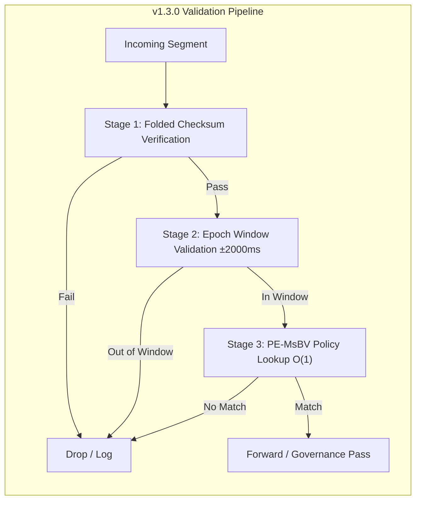

# Active FDO (A-FDO) White Paper  
## v1.3.0-Industrial — Governance-Aware Segment Architecture

**Version:** 1.3.0-Industrial  
**Status:** Aligned with Patent Disclosure (Second Revision) & Reference Implementation  
**Reference:** `src/fdo_gate.py`, `docs/spec/Active_Governance_Header_Spec.md`

---

## Executive Summary

Active FDO extends the Digital Object Interface Protocol (DOIP) with **machine-actionable governance** at the transport segment level. The v1.3.0-Industrial release delivers:

- **O(1) intercept determinism** at the physical layer via the PE-MsBV (Priority-Encoded Multi-stage Bit Vector) pipeline  
- **Clock-cycle deterministic** verification, independent of policy count or payload size  
- **Progressive Convergence I/O Fingerprint** for infringement detection and hardware binding  
- **Epoch-based atomic consistency** for zero-downtime policy updates  

This white paper specifies the technical architecture and aligns with the reference implementation in `fdo_gate.py`.

---

## 1. Technical Specification (v1.3.0 Code-Aligned)

### 1.1 Active Governance Header (16-Byte Fixed Layout)

The header is strictly **16 bytes** (128 bits), big-endian, RFC 8200–aligned. Layout matches `parse_header()` in `fdo_gate.py`:

| Offset | Field | Size | Type | Description |
|--------|-------|------|------|-------------|
| 0x00 | Magic/Version | 2 B | `uint16` | Protocol identifier |
| 0x02 | Epoch Clock | 4 B | `uint32` | Global Epoch (Read-Write Separation; ms precision) |
| 0x06 | I/O Fingerprint | 4 B | `uint32` | Progressive Convergence device signature |
| 0x0A | Masked Policy ID | 4 B | `uint32` | `Policy ID ^ Epoch Clock` (dynamic masking) |
| 0x0E | RLCP & Checksum | 2 B | `uint16` | 4-bit RLCP flags \| 12-bit Folded Checksum |

**Unpack format:** `!HIIIH` (network byte order).

### 1.2 Security Mechanisms (Implementation-Verified)

#### Dynamic Masking

- **Encode:** `Masked_PID = Policy_ID ^ Epoch`
- **Decode:** `Policy_ID = Masked_PID ^ Epoch`
- Ensures each packet for the same policy differs due to advancing Epoch.

#### Epoch Governance Clock

- **Resolution:** 1 ms per tick (`int(time.time() * 1000) & 0xFFFFFFFF`)
- **Window:** ±2000 ms; packets outside this window are rejected (replay/expired).
- **32-bit wrapping:** Signed difference computed for correctness across overflow.

#### Folded Checksum (12-bit)

Checksum over: `(Magic, Epoch, Fingerprint, Masked_PID, RLCP_flags)` XOR folded to 12 bits, plus first 2 bytes of payload (if present). Final value: `xor_sum & 0xFFF`.

#### RLCP Sub-manifold

- **RLCP flags:** Top 4 bits of final 16-bit word (`(rlcp_checksum >> 12) & 0xF`).
- **Checksum:** Bottom 12 bits (`rlcp_checksum & 0xFFF`).

---

## 2. PE-MsBV: O(1) Intercept Determinism at the Physical Layer

### 2.1 Design Principle

The **PE-MsBV** (Priority-Encoded Multi-stage Bit Vector) implements the interception pipeline: a priority-encoded multi-stage bit-vector pipeline for deterministic policy arbitration.

- **Constant-time lookup:** Policy ID → allowed security level in O(1).
- **Fixed execution path:** No data-dependent branching; timing is invariant.
- **Timing side-channel mitigation:** Decisions cannot be inferred from execution time.

### 2.2 Validation Pipeline (Three Fixed Stages)

`validate_segment()` executes exactly three stages, each O(1):

1. **Stage 1: Folded Checksum Verification** — Recompute expected checksum over `(magic, epoch, fingerprint, masked_policy_id, rlcp_flags)` and payload head; compare with `header['checksum']`.
2. **Stage 2: Epoch Window Validation** — Bounded time-window comparison: `abs(diff) <= 2000` ms (±2000 ms); reject replay/expired.
3. **Stage 3: PE-MsBV Policy Lookup** — Single O(1) table access: `policy_id in self.msbv_table` (Priority Arbitration Pipeline).

Total complexity: **O(1)** with respect to policy count and payload size.

### 2.3 MsBV+ Table (Reference Implementation)

| Policy ID | Security Level |
|-----------|----------------|
| 0x01 | Public (0) |
| 0x02 | Restricted (1) |
| 0x03 | Confidential (2) |
| 0x04 | Top Secret (3) |

Unregistered Policy IDs are rejected with a deterministic error message.

---

## 3. Progressive Convergence I/O Fingerprint

### 3.1 AEP Detectability Requirement

Per AEP Detectability Check: the system SHALL include a **Progressive Convergence I/O Fingerprint**—a detectable, non-bypassable response fingerprint derived from physical-layer or timing properties.

The I/O Fingerprint field (4 B) binds packets to the originating hardware interface. Under noisy conditions, the fingerprint estimate converges to a stable value as the connection stabilizes.

### 3.2 Verification Test

The test script `scripts/test_io_fingerprint.py` validates Progressive Convergence:

- Simulates network latency with initial noise (e.g., ±50 ms).
- Applies convergence logic (e.g., noise × 0.85 per iteration).
- **Assertions:**
  - `noise_level < 1.0` — Noise converges within tolerance.
  - `final_variance < 5.0` — Bounded variance over last 3 samples.
  - `len(history) >= 3` — Sufficient samples.

Run: `python3 scripts/test_io_fingerprint.py`

---

## 4. Atomic Epoch Switch & Consistency

### 4.1 Shadow Table & Atomic Pointer Switch

Per AEP: consistency SHALL use **Epoch-based shadow-table switch logic**.

The `atomic_epoch_switch(new_epoch_config=None)` placeholder in `fdo_gate.py` models:

1. Pre-load new policies into a shadow MsBV table.
2. On Epoch Trigger, atomically swap the global state pointer to the shadow table.
3. Zero downtime; consistency preserved during policy rollouts.

### 4.2 Read-Write Separation

Read operations (packet validation) use the active table; writes (policy updates) apply only to the shadow buffer. The swap is atomic: `R(t) ∩ W(t) = ∅`.

---

## 5. RLCP & Hardware Neutrality

### 5.1 RLCP Sub-manifold

The 4-bit RLCP field reserves space for the **RLCP Logical Skeleton Sub-manifold**, utilizing the **Fisher Information Matrix (FIM)** for topology-preserving metabolic protocol (RLCP) and adaptive mask generation.

### 5.2 Hardware Neutrality

Per AEP: specifications SHALL NOT bind to any specific CPU instruction set; they SHALL be expressed in abstract physical-layer descriptions (bit vectors, pipelines, timing).

Specifications are given in terms of bit vectors, pipelines, and physical-layer properties—not CPU-specific instructions.

---

## 6. Specification Compliance Matrix

| Spec Item | fdo_gate.py | Status |
|-----------|-------------|--------|
| 16-byte header | `parse_header()` | ✅ |
| Magic, Epoch, Fingerprint, Masked PID, RLCP+Checksum | `struct.unpack('!HIIIH', ...)` | ✅ |
| Dynamic unmasking `PID = Masked_PID ^ Epoch` | `policy_id = masked_policy_id ^ epoch` | ✅ |
| Folded checksum 12-bit | `calculate_folded_checksum()` | ✅ |
| Epoch window ±2000 ms | `abs(diff) > 2000` | ✅ |
| PE-MsBV O(1) lookup | `policy_id in self.msbv_table` | ✅ |
| Clock-cycle deterministic validation | `validate_segment()` | ✅ |
| atomic_epoch_switch placeholder | `atomic_epoch_switch(new_epoch_config=None)` | ✅ |
| I/O Fingerprint Progressive Convergence | `test_io_fingerprint.py` | ✅ |

---

## 7. References

- **Patent Disclosure:** Second Revision (compliant with Active Governance Header Spec)
- **AEP Protocol:** `docs/.cursorrules` (v1.3.0-Industrial)
- **Header Spec:** `docs/spec/Active_Governance_Header_Spec.md`
- **Reference Implementation:** `src/fdo_gate.py`
- **Convergence Test:** `scripts/test_io_fingerprint.py`

---

*Document maintained in sync with v1.3.0-Industrial codebase.*
