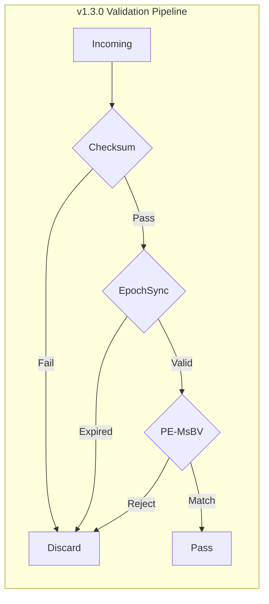

# Active FDO (A-FDO) White Paper
## v1.3.0-Industrial — Governance-Aware Segment Architecture

**Version:** 1.3.0-Industrial  
**Reference:** `src/fdo_gate.py`, `docs/spec/Active_Governance_Header_Spec.md`

---

## Executive Summary

Active FDO extends the Digital Object Interface Protocol (DOIP) with machine-actionable governance at the transport segment level under **evaluator sovereignty**: technical descriptions exhibit non-bypassability and auditability. The v1.3.0-Industrial release delivers:

- **Physical O(1) determinism** at the data plane via the PE-MsBV (Priority-Encoded Multi-stage Bit Vector) **hardware-neutral pipeline**, which achieves clock-cycle determinism by **eliminating branch entropy**—a fixed-depth execution path with no data-dependent branching.
- **RLCP (Reinforcement Learning Compliance Protocol)** as a **topology-preserving metabolic protocol** grounded in the **Fisher Information Matrix (FIM)** to identify and protect the **logical skeleton sub-manifold** of digital objects; the header’s RLCP/checksum field carries both integrity and this metabolic signalling.
- **Progressive Convergence I/O Fingerprint** for infringement detection and hardware binding.
- **Atomic Epoch Switch** for zero-downtime policy **arbitration** and consistency.

This white paper is aligned with the reference implementation in `src/fdo_gate.py`.

---

## 1. Technical Specification (v1.3.0)

### 1.1 Active Governance Header (16 Bytes)

Strictly 16 bytes (128 bits), big-endian, RFC 8200–aligned. Parsed by `parse_header()` in `fdo_gate.py` with unpack format `!HIIIH`:

| Offset | Field | Size | Type | Description |
|--------|-------|------|------|-------------|
| 0x00 | Magic/Version | 2 B | uint16 | Protocol identifier |
| 0x02 | Epoch Clock | 4 B | uint32 | Global Epoch (ms precision) |
| 0x06 | I/O Fingerprint | 4 B | uint32 | Progressive Convergence signature |
| 0x0A | Masked Policy ID | 4 B | uint32 | Policy ID ^ Epoch Clock |
| 0x0E | RLCP & Checksum | 2 B | uint16 | 4b RLCP \| 12b Folded Checksum |

Dynamic unmasking: `policy_id = masked_policy_id ^ epoch`. RLCP flags: `(rlcp_checksum >> 12) & 0xF`. Checksum: `rlcp_checksum & 0xFFF`.

### 1.2 RLCP and the Logical Skeleton Sub-manifold

The **RLCP** (Reinforcement Learning Compliance Protocol) is not merely a checksum layer. It is a **topology-preserving metabolic protocol** whose theoretical foundation is the **Fisher Information Matrix (FIM)**. The FIM is used to characterize the curvature of the governance logic in parameter space; RLCP ensures that policy evolution remains within a **logical skeleton sub-manifold**—the region where the causal structure of digital object governance is preserved and where the identity and integrity of the object’s “skeleton” (minimal sufficient structure for compliance) are identifiable and protected. In the 16-byte header, the **4-bit RLCP field** reserves space for this metabolic signalling (e.g. sub-manifold state or adaptive mask hints); the **12-bit folded checksum** provides integrity over the header and payload head in a **constant-depth XOR tree**, so that verification is both physically O(1) and aligned with the RLCP requirement for fixed-complexity, non-bypassable auditability. Thus the last 16-bit word is not “just a checksum” but the encoding of **RLCP logical skeleton sub-manifold** information plus a deterministic integrity bound.

### 1.3 Other Security Mechanisms

- **Dynamic masking:** Encode `Masked_PID = Policy_ID ^ Epoch`; decode in `parse_header`. Ensures temporal unlinkability of policy identifiers.
- **Epoch window:** ±2000 ms; reject if `abs(diff) > 2000` in `validate_segment` (replay/expiry arbitration).
- **Folded checksum:** 12-bit XOR over header fields and first 2 bytes of payload via `calculate_folded_checksum(header_parts, payload_bytes[:2])`, result `& 0xFFF`; implementation matches the constant-depth property required for branch-entropy elimination.

---

## 2. PE-MsBV Pipeline: Hardware-Neutral and Branch-Entropy Elimination

**PE-MsBV** (Priority-Encoded Multi-stage Bit Vector) is the **hardware-neutral interception pipeline** implemented as MsBV+ (Priority **Arbitration** Pipeline) using `self.msbv_table` in `fdo_gate.py`. Its specification is given in terms of bit vectors, fixed-depth lookup, and pipeline stages—**not** any specific CPU instruction set; thus it is portable across hardware and preserves **evaluator sovereignty** (auditability without vendor lock-in).

**Physical O(1) determinism** is achieved by **eliminating branch entropy**: the execution path length and the set of operations are fixed regardless of policy ID, policy count, or payload size. There are no data-dependent branches that would leak decision outcomes via timing or that would vary the cycle count. Stage 1 always performs one checksum recompute and one compare; Stage 2 always performs one epoch difference and one window compare; Stage 3 always performs one table membership test. The **arbitration** (allow/reject) is thus **deterministic** in the physical sense: same number of operations every time, so that timing side channels are suppressed and the system meets the AEP requirement for clock-cycle-level determinism.

Three fixed stages, each O(1):

1. **Stage 1 — Folded Checksum (RLCP integrity):** Recompute via `calculate_folded_checksum(header_parts, payload_bytes[:2])`; compare with `header['checksum']`. Failure → discard.
2. **Stage 2 — Epoch Window:** Reject if `abs(diff) > 2000`; otherwise segment is within ±2000 ms validity window.
3. **Stage 3 — PE-MsBV Policy Lookup:** Single lookup `policy_id in self.msbv_table` (Priority Arbitration Pipeline); reject if not present.

Total complexity is **O(1)** with respect to policy count and payload size.

### 2.1 MsBV+ Table

In `fdo_gate.py`, `self.msbv_table` is the in-memory realization of the PE-MsBV table (Policy ID → security level; e.g. 0x01–0x04 → Public through Top Secret). Unregistered IDs are rejected by `validate_segment` with a deterministic message. The table supports **constant-time arbitration** and is the software analogue of a fixed-depth bit-vector or CAM lookup in hardware.

---

## 3. Progressive Convergence I/O Fingerprint

The 4-byte I/O Fingerprint field in the header binds packets to the originating hardware interface. Under AEP **Detectability**, the system SHALL provide a **Progressive Convergence I/O Fingerprint**—a detectable, non-bypassable response fingerprint derived from physical-layer or timing behaviour, converging to a stable characterization as the connection stabilizes. Validation is exercised by `scripts/test_io_fingerprint.py` (convergence assertions on noise and variance).

---

## 4. Atomic Epoch Switch and Consistency

The placeholder `atomic_epoch_switch(self, new_epoch_config=None)` in `fdo_gate.py` models the **Shadow Table** and **Atomic Pointer Swap**: (1) pre-load shadow MsBV table with the new epoch’s policies; (2) on Epoch Trigger, atomically swap the global state pointer to the shadow table; (3) zero downtime. Read (validation) and write (policy load) are disjoint; **arbitration** continues against the active table while the shadow is updated, preserving consistency and evaluator sovereignty over the transition.

---

## 5. Specification Compliance Matrix

| Spec Item | fdo_gate.py | Status |
|-----------|-------------|--------|
| 16-byte header | `parse_header()` | OK |
| Unpack !HIIIH | `struct.unpack('!HIIIH', header_bytes)` | OK |
| Dynamic unmasking | `policy_id = masked_policy_id ^ epoch` | OK |
| 12-bit folded checksum (RLCP integrity) | `calculate_folded_checksum()` | OK |
| Epoch window ±2000 ms | `abs(diff) > 2000` in `validate_segment` | OK |
| PE-MsBV O(1) lookup (branch-entropy-free) | `policy_id in self.msbv_table` | OK |
| Three-stage validation | `validate_segment()` | OK |
| Atomic Epoch Switch | `atomic_epoch_switch(new_epoch_config=None)` | OK |
| I/O Fingerprint | Header field; `test_io_fingerprint.py` | OK |

---

## 6. References

- Patent Disclosure: Second Revision (Active Governance Header Spec)
- AEP Protocol: `.cursorrules` (project root)
- Reference Implementation: `src/fdo_gate.py`
- Convergence Test: `scripts/test_io_fingerprint.py`
