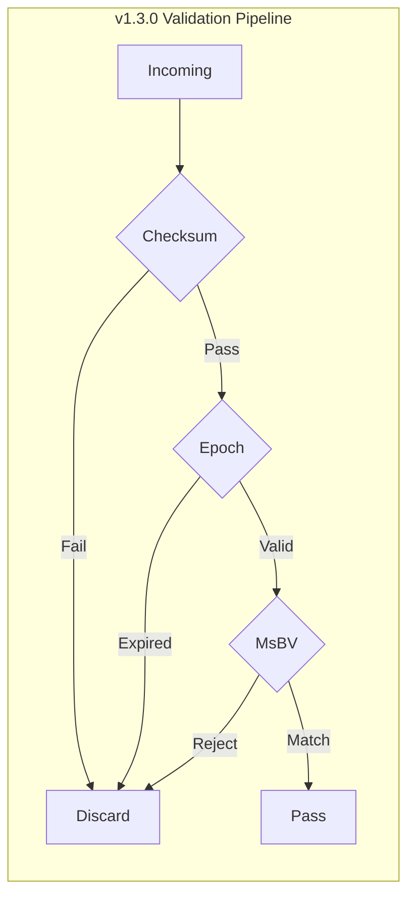

# Active FDO (A-FDO) White Paper
## v1.3.0-Industrial — Governance-Aware Segment Architecture

**Version:** 1.3.0-Industrial  
**Reference:** `src/fdo_gate.py`, `docs/spec/Active_Governance_Header_Spec.md`

---

## Executive Summary

Active FDO extends the Digital Object Interface Protocol (DOIP) with machine-actionable governance at the transport segment level. The v1.3.0-Industrial architecture delivers **physical-layer O(1) determinism** via a hardware-neutral, three-stage pipeline that **eliminates data-dependent branching** (branch-entropy-free arbitration), and grounds integrity and metabolic signalling in the **Fisher Information Matrix (FIM)** through the **RLCP** (Reinforcement Learning Compliance Protocol) and the **Logical Skeleton Sub-manifold**. Terminology and behaviour are aligned with the reference implementation in `src/fdo_gate.py`.

---

## 1. Technical Specification (v1.3.0)

### 1.1 Active Governance Header (16 Bytes, !HIIIH)

Strictly 16 bytes (128 bits), big-endian, RFC 8200–aligned. Parsed by `parse_header(header_bytes)` with `struct.unpack('!HIIIH', header_bytes)`:

| Offset | Field | Size | Type | Description |
|--------|-------|------|------|-------------|
| 0x00 | Magic/Version | 2 B | uint16 | Protocol identifier |
| 0x02 | Epoch Clock | 4 B | uint32 | Global Epoch (ms precision) |
| 0x06 | I/O Fingerprint | 4 B | uint32 | Progressive Convergence signature |
| 0x0A | Masked Policy ID | 4 B | uint32 | Policy ID ^ Epoch Clock |
| 0x0E | RLCP & Checksum | 2 B | uint16 | 4b RLCP \| 12b Folded Checksum |

Dynamic unmasking: `policy_id = masked_policy_id ^ epoch`. RLCP flags: `(rlcp_checksum >> 12) & 0xF`. Checksum: `rlcp_checksum & 0xFFF`.

### 1.2 RLCP, FIM, and the Logical Skeleton Sub-manifold

**RLCP** (Reinforcement Learning Compliance Protocol) is a **topology-preserving metabolic protocol** whose theoretical basis is the **Fisher Information Matrix (FIM)**. The FIM characterizes the curvature of the governance logic in parameter space; RLCP constrains policy evolution to a **Logical Skeleton Sub-manifold**—the region where the causal structure of digital object governance is preserved and where the minimal sufficient structure for compliance (the “skeleton”) is identifiable and protected. In the 16-byte header, the **4-bit RLCP field** carries metabolic/sub-manifold signalling; the **12-bit folded checksum** is a **constant-depth XOR** integrity bound over the header and payload head, implemented by `calculate_folded_checksum(header_parts, payload_bytes[:2])` with result `& 0xFFF`. This design supports **branch-entropy-free** Stage 1 verification and aligns with the logical skeleton sub-manifold integrity requirement.

### 1.3 Security Mechanisms

- **Dynamic masking:** `Masked_PID = Policy_ID ^ Epoch`; decode in `parse_header`.
- **Epoch Sync:** ±2000 ms drift; reject when `abs(diff) > 2000` in `validate_segment`.
- **Folded Checksum:** 12-bit RLCP integrity via `calculate_folded_checksum`; constant-depth, no data-dependent branches.

---

## 2. PE-MsBV: Three-Stage Hardware-Neutral Pipeline

The interception pipeline in `fdo_gate.py` is implemented by **`validate_segment(header_bytes, payload_bytes=b'')`**. It is **hardware-neutral** (specified as bit layout, fixed-depth stages, and table lookup—no CPU-specific instructions) and achieves **physical O(1) determinism** by **eliminating branch entropy**: the execution path length is fixed regardless of policy ID, policy count, or payload size.

1. **Stage 1 — Folded Checksum (12-bit RLCP integrity):** Recompute via `calculate_folded_checksum(header_parts, payload_bytes[:2])`; compare with `header['checksum']`. Single compare; no branching on payload length beyond the fixed 2-byte head.
2. **Stage 2 — Epoch Sync (±2000 ms drift validation):** Compute epoch difference with 32-bit wrapping; reject if `abs(diff) > 2000`. Fixed arithmetic and one comparison.
3. **Stage 3 — PE-MsBV Lookup (branch-entropy-free O(1) arbitration):** Single membership test `policy_id in self.msbv_table` (Priority Arbitration Pipeline). Constant-time; no data-dependent branches.

Total complexity is **O(1)**. The following flowchart reflects the pipeline:

### 2.1 MsBV+ Table

In `fdo_gate.py`, `self.msbv_table` is the active PE-MsBV table (Policy ID → security level; e.g. 0x01–0x04). Unregistered IDs are rejected by `validate_segment` with a deterministic message. The table supports **constant-time arbitration**; updates are applied via **`atomic_epoch_switch(new_epoch_config)`** (Shadow Table and Atomic Pointer Swap).

---

## 3. Atomic Epoch Switch (Shadow Table and Atomic Pointer Swap)

The method **`atomic_epoch_switch(self, new_epoch_config=None)`** implements the Shadow Table and Atomic Pointer Swap: new policies are supplied as `new_epoch_config`; the active arbitration table is replaced atomically (in simulation, `self.msbv_table` is reassigned to the new table). Read (validation) and write (policy load) are disjoint; **zero downtime** and no branch entropy or read-write conflict during the swap.

---

## 4. Progressive Convergence I/O Fingerprint

The 4-byte I/O Fingerprint field in the header binds segments to the originating hardware interface. AEP requires a **Progressive Convergence I/O Fingerprint** (detectable, non-bypassable). Validation is exercised by `scripts/test_io_fingerprint.py`.

---

## 5. Specification Compliance Matrix

| Spec Item | fdo_gate.py | Status |
|-----------|-------------|--------|
| 16-byte header !HIIIH | `parse_header()` | OK |
| Dynamic unmasking | `policy_id = masked_policy_id ^ epoch` | OK |
| 12-bit folded checksum (RLCP integrity) | `calculate_folded_checksum()` | OK |
| Epoch Sync ±2000 ms | `abs(diff) > 2000` in `validate_segment` | OK |
| PE-MsBV O(1) lookup (branch-entropy-free) | `policy_id in self.msbv_table` | OK |
| Three-stage validation | `validate_segment()` | OK |
| Shadow Table & Atomic Pointer Swap | `atomic_epoch_switch(new_epoch_config=None)` | OK |
| I/O Fingerprint | Header field; `test_io_fingerprint.py` | OK |

---

## 6. References

- Patent Disclosure: Second Revision (Active Governance Header Spec)
- AEP Protocol: `.cursorrules` (project root)
- Reference Implementation: `src/fdo_gate.py`
- Convergence Test: `scripts/test_io_fingerprint.py`
