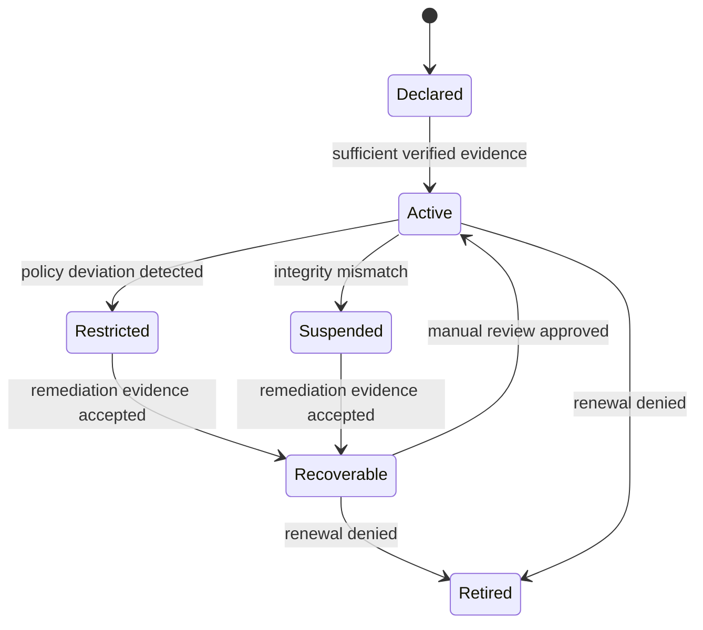

# Minimal Lifecycle State Machine for Evidence-Driven Object Governance

This state machine exists to make lifecycle governance operational rather than purely descriptive. A minimal profile is necessary because evidence-driven governance becomes ambiguous if state changes, privilege adjustments, and recovery paths are left to ad hoc interpretation. The model below provides a reviewable baseline for how verifiable behavioral evidence influences object status while remaining compatible with policy-specific extensions.

| Current State | Trigger | Next State | Governance Action | Evidence Requirement |
|---|---|---|---|---|
| Declared | sufficient verified evidence | Active | activation approval | Evidence bundle confirms baseline policy conformance and required attestations |
| Active | policy deviation detected | Restricted | privilege reduction | Verifiable behavioral evidence shows repeated or material policy deviation |
| Active | integrity mismatch | Suspended | temporary quarantine | Integrity checks or attestations indicate tampering, mismatch, or execution failure |
| Restricted | remediation evidence accepted | Recoverable | mandatory review | Corrective evidence demonstrates remediation completion and updated policy status |
| Recoverable | manual review approved | Active | reinstatement after verified recovery | Reviewer confirms recovery condition satisfaction using current evidence bundle |
| Suspended | remediation evidence accepted | Recoverable | evidence regeneration request | Fresh evidence bundle restores minimum reviewability after suspension |
| Recoverable | renewal denied | Retired | renewal denial | Review outcome rejects continued operation at renewal boundary |
| Active | renewal denied | Retired | renewal denial | Periodic or event-driven review determines continued operation is not permitted |

## Boundary Clarification

This state machine bounds object-specific governance transitions only. It does not compute a general personality score, a cross-domain permanent reputation value, or a universal trust ranking. A lifecycle state is not a universal reputation score, and final governance responsibility remains with policy and authorized review.

This state machine is intentionally minimal and is intended as a profile-ready governance scaffold rather than a full trust ontology.
